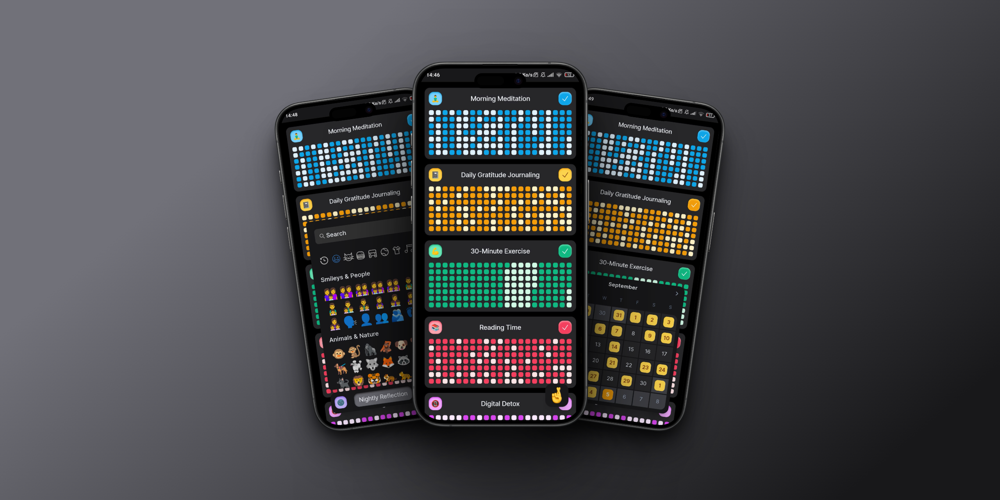
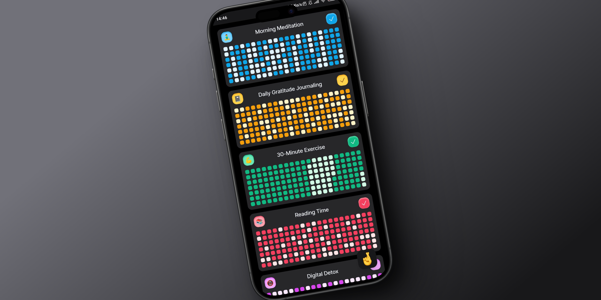
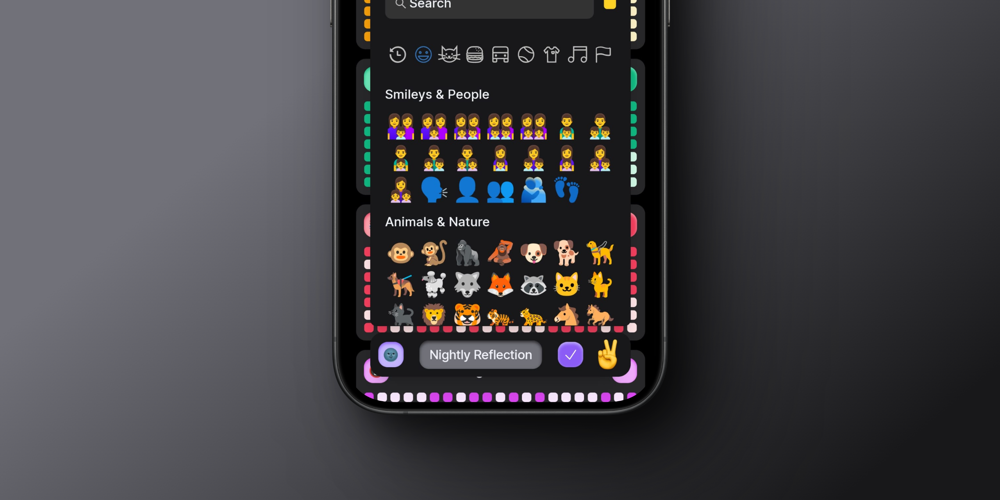
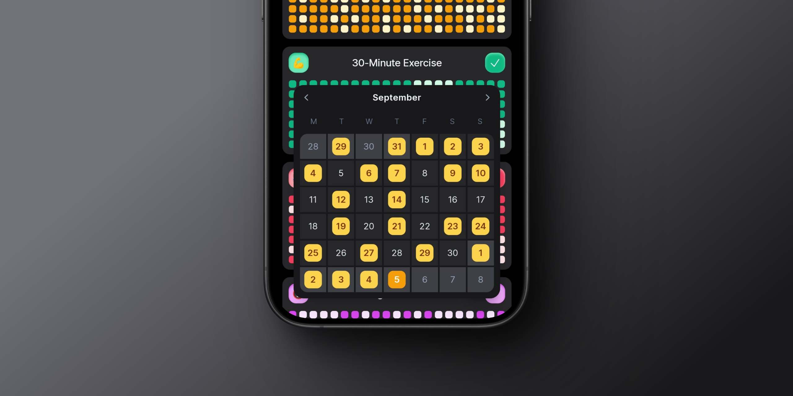
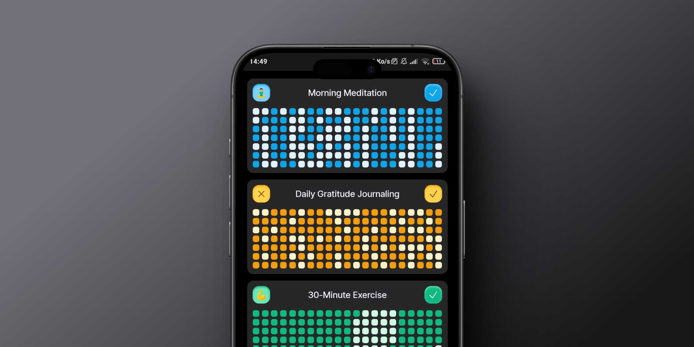

# Habits 🤞

**`A simple habit tracking app`** - [**`habits.arn.sh`**](https://habits.arn.sh) 🚀

> _**Note: this app was a pet project for personal use and was never intended to run correctly on desktop, use it only on mobile.**_

## What

Habits is a simple habit tracking app shipped in an offline-oriented standalone PWA ([Progressive Web App](https://developer.mozilla.org/en-US/docs/Web/Progressive_web_apps)) format, heavily inspired in GitHub's commit frequency chart. You can use Habits in any device through a web browser accessing [**habits.arn.sh**](https://habits.arn.sh) and even install it for a more native-like experience.

### Dashboard

With Habits you can track an unlimited amount of daily activities with 7 different color palettes an every emoji imaginable. Habits and completions are only saved in your local storage. To complete your daily Habit just tap on its ✅ button!

### Create Habits

To create an Habit is as simple as tapping on the floating button on the bottom-right corner. Change the Habit's name with the input box; change the icon tapping on the default 🚀 emoji; and change the color by holding down the icon, it will circle through the different available palettes. Finally, tap on the ✅ button to save it.

### Check and Edit the Calendar

By tapping on the Habit's tracking graph you will access a calendar where you will be able to check specifically whether a certain day you completed the Habit or not. Moreover, you will be able to edit the completions by tapping on the desired dates.

### Delete Habits

To delete an Habit hold down the card itself, an ❎ button will appear in the top-left corner of the card, tap on it to delete the selected Habit.

## Contribute

Feel free to contribute to this project : ) .

## License

This project is licensed under the [GPL-3.0 License](https://opensource.org/license/gpl-3-0) - read the [LICENSE](LICENSE) file for details.
